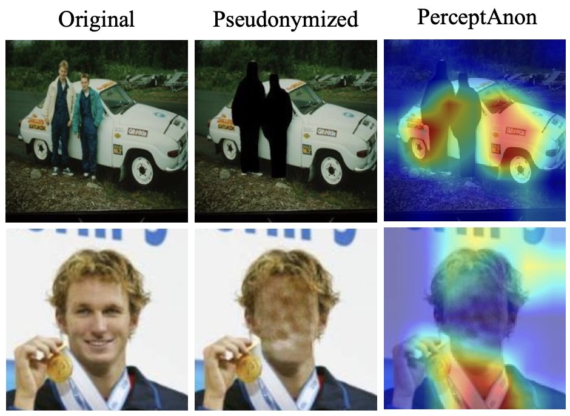

## [ICML 2024] PerceptAnon: Exploring the Human Perception of Image Anonymization Beyond Pseudonymization for GDPR

<!-- [Kartik Patwari](https://kartikp7.github.io/), [Chen-Nee Chuah](https://www.ece.ucdavis.edu/~chuah/rubinet/people/chuah/bio.html), [Lingjuan Lyu](https://sites.google.com/view/lingjuan-lyu/home), [Vivek Sharma](https://vivoutlaw.github.io/) -->

<div align="center">

[Paper](https://proceedings.mlr.press/v235/patwari24a.html) · [Project Page](https://kartikp7.github.io/perceptanon_project_page/)

<p align="center">

</p>

</div>

## Table of Contents

- [PerceptAnon Dataset](#perceptanon-dataset)
- [Environment Setup](#environment-setup)
- [Main Results](#main-results)
  - [Dataset Splits](#dataset-splits)
  - [Training/Evaluation](#trainingevaluation)
  - [Evaluation](#evaluation)
  - [Visualization](#visualization)
- [Citation](#citation)

## PerceptAnon Dataset

Please download and unzip the dataset/annotations from this [Google Drive link](https://drive.google.com/drive/folders/1MSLB2MpxvCup2lyLhDeFq3SVdsD79VxD?usp=sharing).

- Images are stored in the `perceptanon_dataset/` folder.
- Annotations are provided in CSV files: `HA1.csv` and `HA2.csv`.

### CSV Annotations Format
Each row in the CSV files follows this structure:

```
original_image_path, anonymized_image_path, source_dataset, scope, method, ... , score_mean
```
Between `method` and `score_mean` are annotator IDs and their individual scores. `score_mean` has mean annotation score.

## Environment Setup

This code was run using Python 3.9

```bash
pip install -r requirements.txt
```

## Main Results

### Dataset Splits

To create the dataset splits from main paper table 1 and 2, please run `generate_splits.py` with path to downloaded `data/` folder containing annotations (.csv).

```bash
python generate_splits.py -f data/
```
This will create directory called `dataset_splits/` which contains for all, loov, task splits the train, val, and test sets. 

### Training/Evaluation

Use `run_experiments.py` to train and evaluate (correlation score).
All other metrics (PSNR, FID, ...) with instructions are provided in [metrics/](./metrics/). This script calls both train and evaluation scripts and creates log file with both training logs and correlation scores.

#### Usage
Run the script using the following command:

```bash
python run_experiments.py --ha_mode <HA1/HA2> \
    --data_root <path_to_dataset> \
    --split_type <dataset_split> \
    --label_type <label_granularity> \
    --model_name <base_architecture> \
    [options]
```

For more details, refer to `run_experiments.py` or run:
```bash
python run_experiments.py -h
```

#### Trained Model Weights

Provided weights are on 'all' train-test configuration. Other pretrained models will be added soon!

|   Arch.   | HA1/HA2 | Clf/Reg | Label Gran. | (ρ/τ) | Model |
|-----------|--------|---------|------------------|----------------------|-------------------------|
| ResNet50  | HA1   | clf     | mean               | 0.88 / 0.70         | [link]()                 |


### Evaluation

`eval.py` contains codes for evaluating PerceptAnon networks. To compute other reported metrics like SSIM, FID, etc please see [metrics/](./metrics/).

### Visualization

`gradcam.ipynb` contains example code to visualize PerceptAnon's heatmaps using [pytorch gradcam](https://github.com/jacobgil/pytorch-grad-cam).

## Citation

If you find PerceptAnon is useful in your research or applications, please consider giving us a star 🌟 and citing it.

```bibtex
@inproceedings{patwari2024perceptanon,
  title={PerceptAnon: Exploring the Human Perception of Image Anonymization Beyond Pseudonymization for GDPR},
  author={Patwari, Kartik and Chuah, Chen-Nee and Lyu, Lingjuan and Sharma, Vivek},
  booktitle={International Conference on Machine Learning},
  year={2024}
}
```